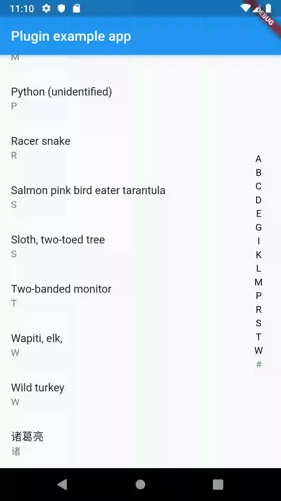

# Alphabet List Scroll View

Quick scroll through list via dragging through alphabets. 

## API
| name | type | default | description |
| --- | --- | --- | --- |
| strList | List<String> | -  | List of Strings |
| itemBuilder | itemBuilder(context, index) | - | itemBuilder similar to itemBuilder in ListView.builder |
| highlightTextStyle | bool | false | highlight the focused pin box. |
| normalTextStyle | Color | Colors.black | Set color of the focused pin box. |
| showPreview | bool | Colors.black | Set color of the focused pin box. |

